# Deploy API on NGINX server
## 1. Install the nginx package with :

```sh
sudo apt-get install nginx 
```
<p align="center">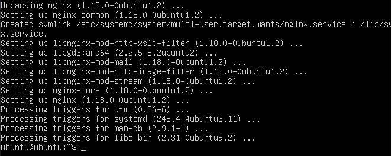</p>

## 2. Set up engine

```sh
curl -sL https://deb.nodesource.com/setup_14.x -o nodesource_setup.sh 
```
<p align="center">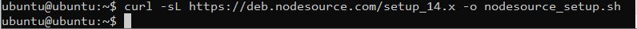</p>

```sh
sudo bash nodesource_setup.sh 
```
<p align="center"></p>

```sh
sudo apt-get install gcc g++ make -y 
```
<p align="center">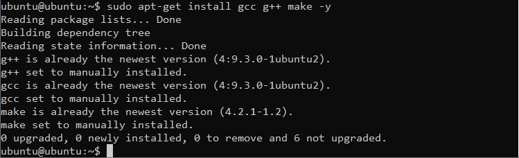</p>

```sh
curl -sL https://dl.yarnpkg.com/debian/pubkey.gpg | gpg --dearmor | sudo tee /usr/share/keyrings/yarnkey.gpg >/dev/null
```
<p align="center">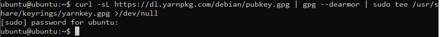</p>

```sh
echo "deb [signed-by=/usr/share/keyrings/yarnkey.gpg] https://dl.yarnpkg.com/debian stable main" | sudo tee /etc/apt/sources.list.d/yarn.list
```
<p align="center">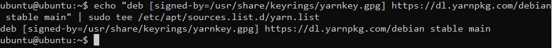</p>

## 3. Install yarn

```sh
sudo apt-get update && sudo apt-get install yarn
```
<p align="center">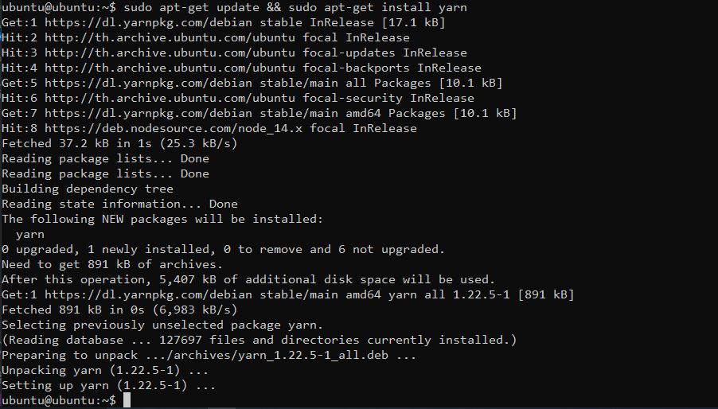</p>

```sh
sudo apt install build-essential
```
<p align="center">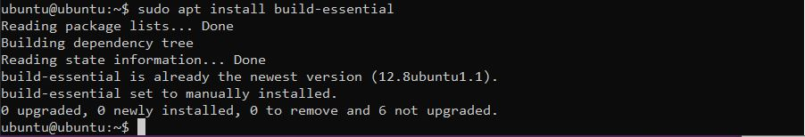</p>

## 4. Clone api on GitHub to ubuntu server
4.1 Set up git config

```sh
git config --global user.name [your username of GitHub Account]
```

```sh
git config --global user.email [your email of GitHub Account]
```
<p align="center">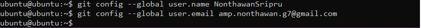</p>

4.2 Clone api repository on github and type your username and access token of your git account

```sh
git clone https://github.com/virus08/dwapi.git
```
<p align="center"></p>

4.3 
```sh
cd dwapi/
```
<p align="center">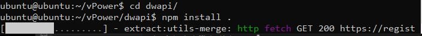</p>

4.4 npm install .

```sh
npm install .
```

4.5 Install pm2 for run production


```sh
sudo npm install pm2@latest -g
```
```sh
pm2 start index.js
```
<p align="center">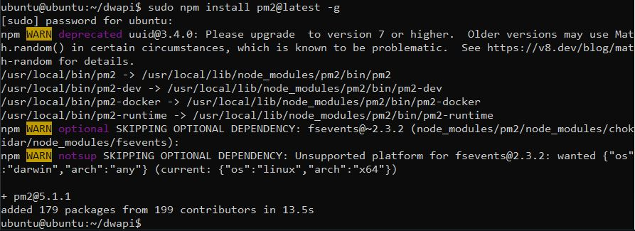</p>
<p align="center">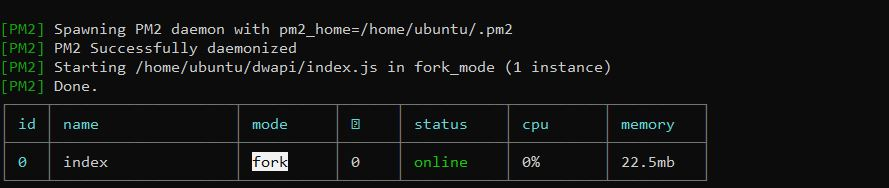</p>

## 5. Configuring NGINX
5.1 open up the NGINX default site config file

```sh
sudo nano /etc/nginx/sites-available/default
```
5.2 If you want, you can go directly to the directory and open up the config file with your favorite text editor. As you scroll down, you’ll find a server block. It looks something like this:
 
```sh
server {
  listen       80;
  server_name  localhost;

  ....
  more config goes here
}
```

5.3 Next, we’ll configure the server block to suit our needs. We want to configure NGINX to pass all requests through to our Node.js server. Replace the above server block with a new block as shown below:

 <p align="center">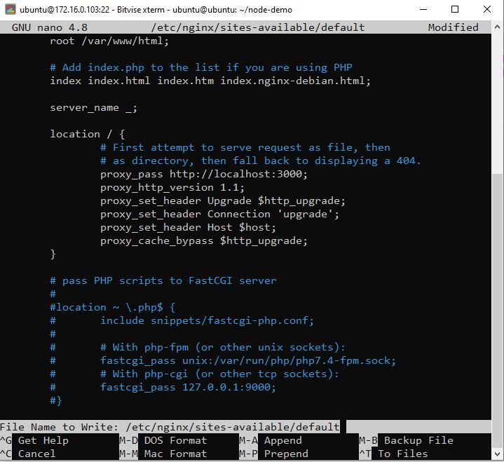</p>
 
```sh
server {
  listen       80;
  server_name  _;

  location / {
    proxy_pass http://localhost:5000;
    proxy_http_version 1.1;
    proxy_set_header Upgrade $http_upgrade;
    proxy_set_header Connection 'upgrade';
    proxy_set_header Host $host;
    proxy_cache_bypass $http_upgrade;
  }
```

5.4 save the file and type the following to restart NGINX
<p align="center">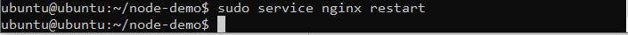</p>

```sh
sudo nginx -t
```

<p align="center">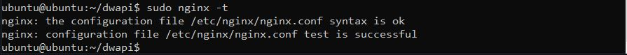</p>

```sh
sudo service nginx restart
```
<p align="center">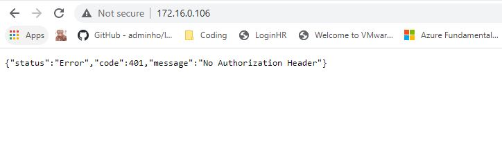</p>

## 6. Install ssl certificate on nginx server for run HTTPs
6.1 Create certificate and key

```sh
sudo openssl req -x509 -nodes -days 365 -newkey rsa:2048 -keyout vstecs.key -out vstecs.crt
```
<p align="center">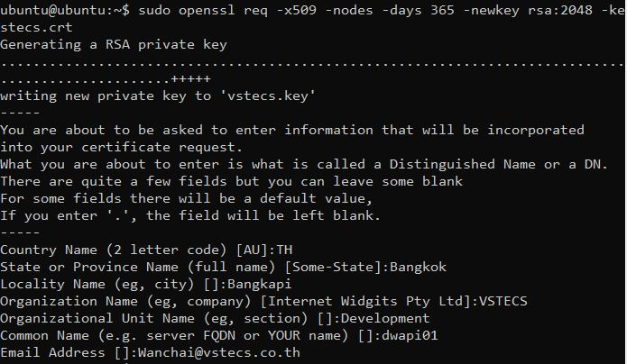</p>

6.2 Input certificate data
6.3 Check certificate file
 
```sh
ls
```

```sh
more vstecs.crt
```

6.4 Go to root and make directory for keep certificate file and key in folder ssl
 
```sh
sudo -i

```
```sh
cd /etc/nginx/
```
```sh
mkdir ssl
```
```sh
cd ssl

```
```sh
cp /home/ubuntu/vstecs.* .
```

<p align="center">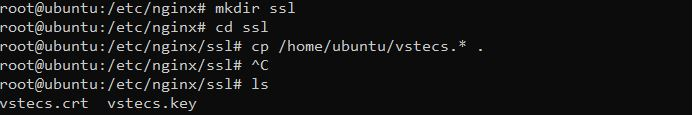</p>

6.5 Create file vstecs.conf in folder conf.d
```sh
cd conf.d
nano vstecs.conf
```
<p align="center">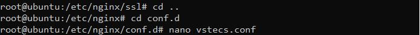</p>

```sh
server{
			listen   443 ssl;
			listen   [::]:433 ssl;
			server_name  dwapi01.vstecs.co.th;

			#ssl on;
			ssl_certificate /etc/nginx/ssl/vstecs.crt;
			ssl_certificate_key /etc/nginx/ssl/vstecs.key;

			root  /var/www/html;

			location / {
				proxy_pass http://localhost:5000;
    				proxy_http_version 1.1;
    				proxy_set_header Upgrade $http_upgrade;
    				proxy_set_header Connection 'upgrade';
    				proxy_set_header Host $host;
    				proxy_cache_bypass $http_upgrade;
			}
		}
```
<p align="center">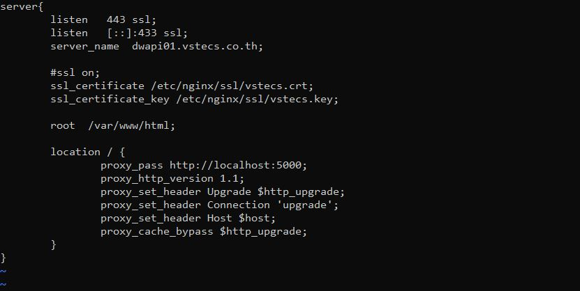</p>

6.6 Check config and restart server with command 

```sh
nginx -t
systemctl restart nginx
```
<p align="center">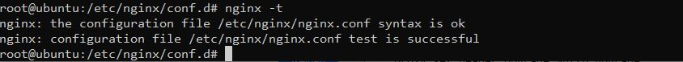</p>

6.7 Finally open IP Address ( https://172.16.0.106 ) Look at the IP Address of the machine itself.

<p align="center"></p>


 


